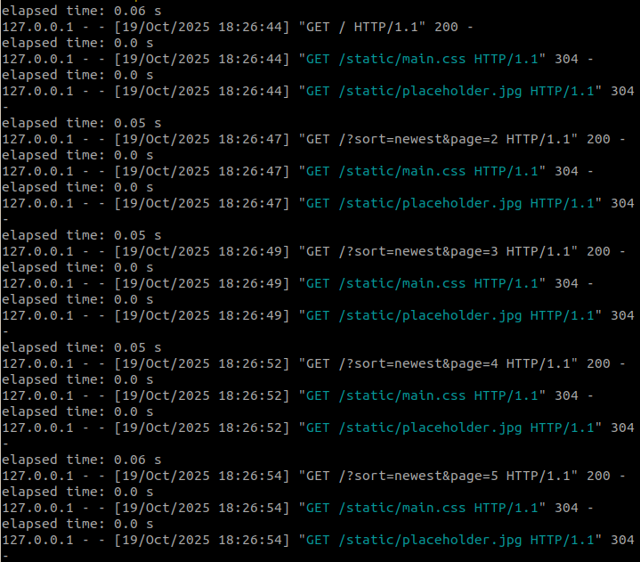
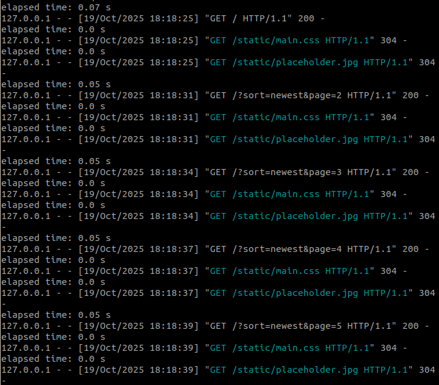

# Vinyl Cabinet

A web application for managing and reviewing vinyl album collections. Users can add albums, write reviews, add favorites, and discover albums added by other users.

## Features

### Core Functionality

- **User Authentication**: Register an account and log in securely
- **Album Management**: Add, edit, and delete vinyl albums from your collection
- **Album Reviews**: Write and read reviews with star ratings (1-5 stars)
- **Favorites System**: Bookmark albums to your personal cabinet
- **User Profiles**: View detailed user profiles with statistics and activity
- **Search & Sort**: Find albums by title, artist, genre, or year with multiple sorting options
- **Genre Categorization**: Tag albums with multiple genres for better organization

### Additional Features

- **Profile Customization**: Add bio, location, profile picture, and favorite genre
- **Activity Tracking**: See recent albums and reviews from users
- **User Statistics**: Track albums added, reviews written, and average ratings

## Installation and Setup

1. **Clone the repository**

2. **Create a virtual environment**

   ```bash
   python3 -m venv venv
   source venv/bin/activate
   ```

3. **Install dependencies**

   ```bash
   pip install flask werkzeug
   ```

4. **Initialize the database in root**

   ```bash
   sqlite3 database.db < schema.sql
   ```

5. **Run the application**
   ```bash
   flask run
   ```

## Testing with Large Datasets

### Seed the database with test data

```bash
python3 seed.py
```

This creates:

- 100000 users
- 1000000 albums
- 5000000 reviews
- 30% of users have profiles
- Random favorites assignments

### Large Data Performance Results

Without database indexing:


With database indexing:


### Clear test data

```bash
python3 clear.py
```

### Running Pylint

```bash
pylint app.py database.py db.py
```

[PYLINT_REPORT.md](PYLINT_REPORT.md)
